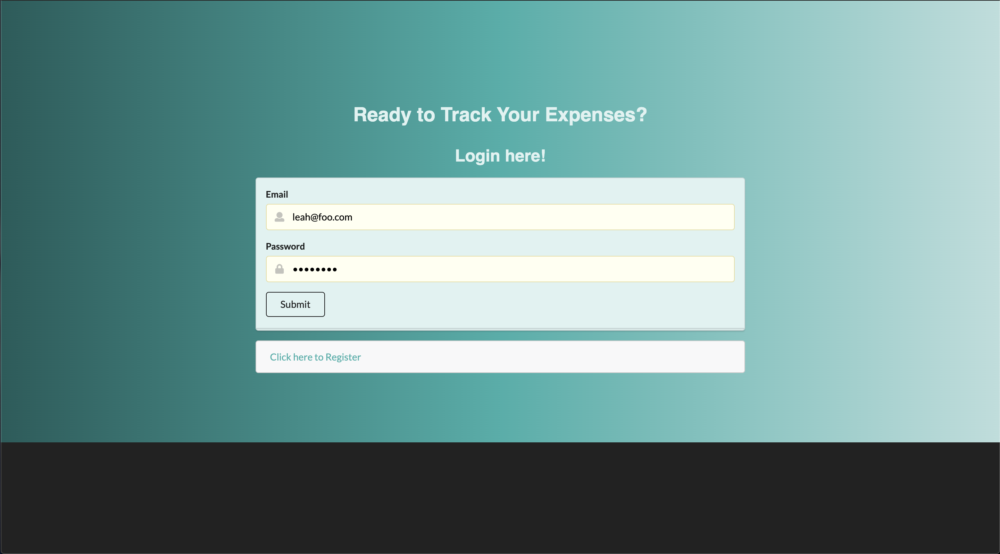
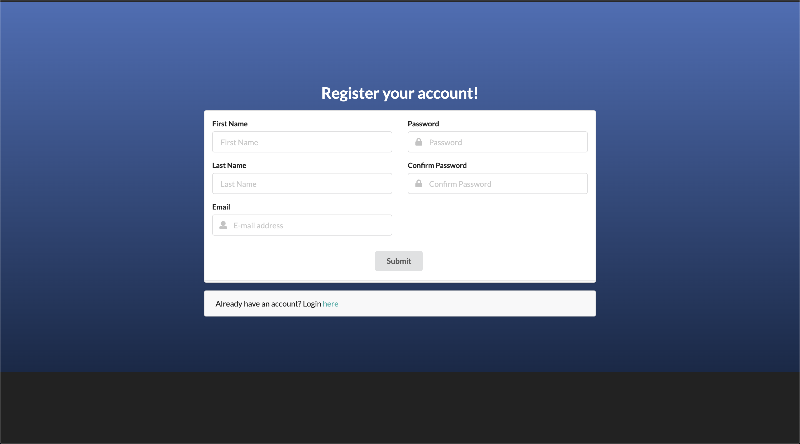
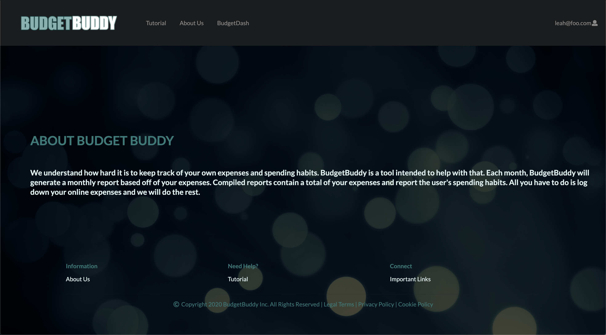
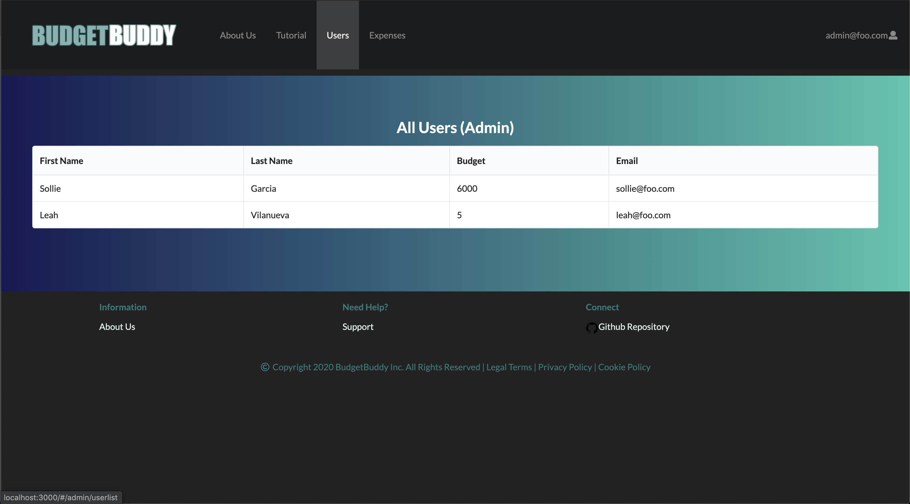
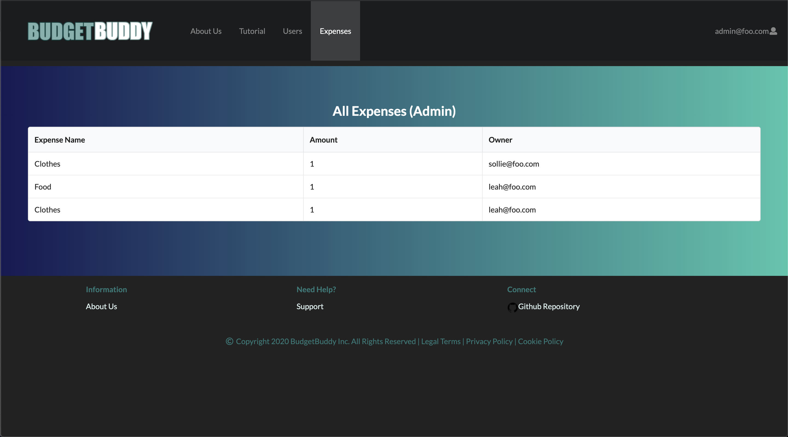

Note: Initilization of meteor-application-template-react was used for our app initialization. Template used from ICS 314 professors Philip Johnson and Cam Moore
  at this link: [https://github.com/ics-software-engineering/meteor-application-template-react](https://github.com/ics-software-engineering/meteor-application-template-react)

## Installation

For instructions on installation go to our go to [README.md](https://github.com/leahmeiv/465Final/blob/master/README.md).

## Walkthrough

The following sections describe the major features of this application

#### Landing page

When you retrieve the app at [http://localhost:3000](http://localhost:3000), this is what should be displayed without a user signed in:

The next step is to use the Login menu to either Login to an existing account or register a new account.

#### Login page

Clicking on the Login link, then on the Sign In menu item displays this page:

* Default Users:
  * User: leah@foo.com
  * Password: changeme
  
  * User: sollie@foo.com
  * Password: changeme

#### Register page

Alternatively, clicking on the Login link, then on the Sign Up menu item displays this page:

#### Landing (after Login) page, non-Admin user

Once you log in (either to an existing account or by creating a new one), the navbar shows up as follows:

You can now add new Stuff documents, and list the Stuff you have created. Note you cannot see any Stuff created by other users.

#### BudgetDash page

After logging in, here is the page that allows you to add your budget. As you can see there are already default budgets which you can delete:

#### Edit Profile page

In the User navbar logo there is a edit profile button where a user is able to edit their budget cost:

You change your values and press submit. Above it shows what your current information is.

#### Landing (after Login), Admin user

You can define an "admin" user in the settings.json file. This user, after logging in, gets a special entry in the navbar:

#### Admin page (list all users)

To provide a simple example of a "super power" for Admin users, the Admin page lists all of the users:

![]

Note that non-admin users cannot get to this page, even if they type in the URL by hand.

#### Admin page (list all expenses)

To provide a simple example of a "super power" for Admin users, the Admin page lists all of the users expenses:

![]

Note that non-admin users cannot get to this page, even if they type in the URL by hand.

### CSS

The application uses the [React implementation of Semantic UI](http://react.semantic-ui.com/).

### Routing

For display and navigation among its four pages, the application uses [React Router](https://reacttraining.com/react-router/).

Routing is defined in [imports/ui/layouts/App.jsx](https://github.com/leahmeiv/465Final/blob/master/app/imports/ui/layouts/App.jsx).

### Authentication

For authentication, the application uses the Meteor accounts package.

When the application is run for the first time, a settings file (such as [config/settings.development.json](https://github.com/leahmeiv/465Final/blob/master/config/settings.development.json)) should be passed to Meteor. That will lead to a default account being created through the code in [imports/startup/server/BBAccounts.js](https://github.com/leahmeiv/465Final/blob/master/app/imports/startup/server/BBAccounts.js).

The application allows users to register and create new accounts at any time.

### Authorization

Only logged in users can manipulate Stuff documents (but any registered user can manipulate any Stuff document, even if they weren't the user that created it.)

### Configuration

The [config](https://github.com/leahmeiv/465Final/tree/master/config) directory is intended to hold settings files.  The repository contains one file: [config/settings.development.json](https://github.com/leahmeiv/465Final/blob/master/config/settings.development.json).

